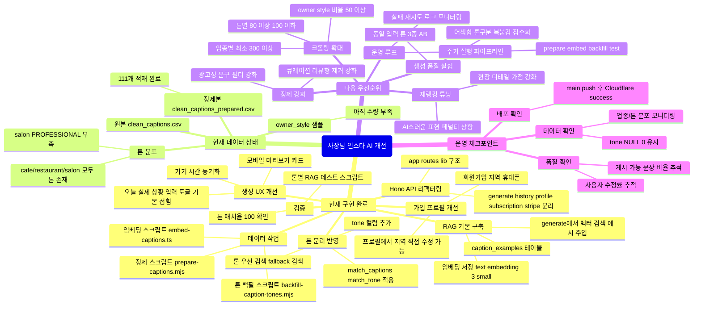

# Instagram RAG Mindmap

```mermaid
mindmap
  root(사장님 인스타 AI 개선)
    현재 구현 완료
      Hono API 리팩터링
        app routes lib 구조
        generate history profile subscription stripe 분리
      가입 프로필 개선
        회원가입 지역 휴대폰
        프로필에서 지역 직접 수정 가능
      생성 UX 개선
        모바일 미리보기 카드
        기기 시간 동기화
        오늘 실제 상황 입력 토글 기본 접힘
      RAG 기본 구축
        caption_examples 테이블
        임베딩 저장 text embedding 3 small
        generate에서 벡터 검색 예시 주입
      톤 분리 반영
        tone 컬럼 추가
        match_captions match_tone 적용
        톤 우선 검색 fallback 검색
      데이터 작업
        정제 스크립트 prepare-captions.mjs
        임베딩 스크립트 embed-captions.ts
        톤 백필 스크립트 backfill-caption-tones.mjs
      검증
        톤별 RAG 테스트 스크립트
        톤 매치율 100 확인

    현재 데이터 상태
      원본 clean_captions.csv
      정제본 clean_captions_prepared.csv
        111개 적재 완료
      owner_style 샘플
        아직 수량 부족
      톤 분포
        cafe/restaurant/salon 모두 톤 존재
        salon PROFESSIONAL 부족

    다음 우선순위
      크롤링 확대
        업종별 최소 300 이상
        톤별 80 이상 100 이하
        owner style 비율 50 이상
      정제 강화
        큐레이션 리뷰형 제거 강화
        광고성 문구 필터 강화
      생성 품질 실험
        동일 입력 톤 3종 AB
        어색함 톤구분 복붙감 점수화
      재랭킹 튜닝
        AI스러운 표현 페널티 상향
        현장 디테일 가점 강화
      운영 루프
        주기 실행 파이프라인
          prepare embed backfill test
        실패 재시도 로그 모니터링

    운영 체크포인트
      배포 확인
        main push 후 Cloudflare success
      데이터 확인
        tone NULL 0 유지
        업종/톤 분포 모니터링
      품질 확인
        게시 가능 문장 비율 추적
        사용자 수정률 추적
```
